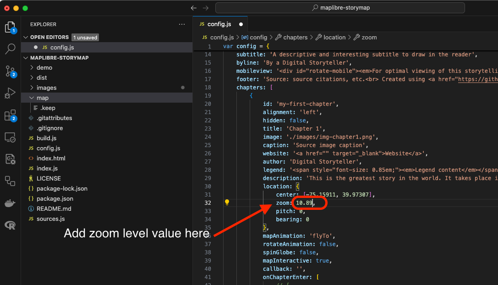

- TOC
{:toc}

# Add chapters

Now that you have the basic configuration of your storymap, it is time to add data to your chapters.
Chapters contain the contents of your story. Each of them is a box with text and mutimedia that will scroll on top of your basemap.

You will need to add and set some details in the `config.js` file to create the chapters of your story.
Starting on line 18 of the `config.js` file, you will see the chapters and its properties.

At the bottom of this page you have a detail on the function of each property of the chapters in the `config.js` file.
We will go through the basic properties in the following steps.

### *1*{: .circle .circle-blue} Setting up your first chapter.

Step 1
{: .label .label-step}

Add an `id` to your fist chapter. Just type any text that will identify your firts chapter.

Input
{: .label .label-green }
```
20  id: 'my-first-chapter'
```
Remember to use dashes to separate words and lowercase letters for the chpater id. 
{: .warn}


Step 2
{: .label .label-step}

Add a `title` to your chapter. On line 23, add a text to be your chapter title.

Input
{: .label .label-green }
```
23  title: 'Chapter 1'
```


Step 3
{: .label .label-step}

Add a `description` to your chapter. This section will contain the main text of this chapetr. On line 29, add all the text for this chapter.

Input
{: .label .label-green }
```
29  description: 'This is the greatest story in the world. It takes place in the city of Philadelphia'
```


### *2*{: .circle .circle-blue} Adding an image to your chapter.

Step 1
{: .label .label-step}

Give the image you are going to use a simple but easy to identify name. For example `img_chapter1.png`.

Step 2
{: .label .label-step}

1. On your system browser, navigate to the `maplibre-storymap` repository folder.

2. Inside this folder you will see another folder named `images`.

3. Save your image `img-chapter1.png` into this folder.


Step 3
{: .label .label-step}

Go back to the `config.js` file on `Visual Studio Code` and add the following:

Input
{: .label .label-green }
```
24  image: './images/img-chapter1.png'
```


### *3*{: .circle .circle-blue} Setting the location of the chapter in the map.

Another feature of storymaps is the ability to center the basemap on a specific point to higlight the story you are telling. In this demo, we are telling a story about the city of Philadelphia, we are going to locate the map so that it displays an overview of the city with the centerpoint on City Hall. 

The map view is controlled by the properties under `location:` from line 31 to 34 in the `confi.js` file. The first two options, `center` and `zoom` being the most important as the set the coordinates where the map is centered and how far in or out is is zoomed in. To help you decide this properties values we are going to use the [Location Helper](https://labs.mapbox.com/location-helper/#3/40.78/-73.97) web app.

Step 1
{: .label .label-step}

On your internet browser, navigate to the [Location Helper](https://labs.mapbox.com/location-helper/#3/40.78/-73.97) web app.

You are going to see a map and a window with some numeric values for `center (array)`, `center (object)`, `zoom`, `bearing`, `pitch` and others on the left side of the screen. Notice a circle marking the center of the map.

Navigate the map using the `Navigation controls` or the `Search bar` on the top right corner of the screen, untill you see the map as you want it to be displayed in your chapter. 


In this demo, we typed on the search bar `Philadelphia, Pennsylvania` and the resulting map looks good for the purpose of the first chapter.


Step 2
{: .label .label-step}

Copy the values on the `center (array)` peoperty of the `Location Helper` web app and paste it in the `center:` property on line 31 of the `config.js` file you have opened in Visual Studio Code.

Input
{: .label .label-green }
```
31  center: [-75.15911, 39.97307],
```
Note that the coordinates are within [ ] symbols and separated by a comma. 
{: .warn}


Step 3
{: .label .label-step}

Copy the values on the `zoom` peoperty of the `Location Helper` web app and paste it in the `zoom:` property on line 32 of the `config.js` file you have opened in Visual Studio Code.

Input
{: .label .label-green }
```
32  zoom: 10.89,
```



### *4*{: .circle .circle-blue} Adding more chapters to your story map.

The Digital Democracy template has two chapters added to the map. 

A chapter has the following structure:

```
{
            id: 'chapter-id',
            alignment: 'left',
            hidden: false,
            title: 'Chapter title',
            image: './images/name.png',
            caption: 'Source image caption',
            website: '<a href="" target="_blank">Website</a>',
            author: 'Digital Storyteller',
            legend: '<span style="font-size: 0.85em;"><em>Legend content</em></span>',
            description: 'Your chapter content',
            location: {
                center: [-75.15911, 39.97307],
                zoom: 10.89,
                pitch: 0,
                bearing: 0
            },
            mapAnimation: 'flyTo',
            rotateAnimation: false,
            spinGlobe: false,
            mapInteractive: true,
            callback: '',
            onChapterEnter: [],
            onChapterExit: []
        },
```
To add new chapters to your storymap, simply `copy` this text and paste it right after the `}` symbol that closes the previous chapter. Be sure to include a `,` after the symbol and paste the text before the `]` that closes the chapters section on the code.


Add as many chapters as you like. 

Don't forget to add th data and specifications needed in each chapter. In the next section of this tutorial you will learn how to preview your storymap.

Go ahead and play around changing some chapter settings like `aligment` and `rotateAnimantion`.
{: .note }


| Property | Function
| --- | ---
| `id:` | A slug-style ID for the chapter. This is read by the JavaScript driving the app and is assigned as an HTML `id` for the `div` element containing the rest of the story. A best-practice format would be to use kebab case, like `my-story-chapter-1`.
| `alignment:` | This defines where the story text should appear over the map. Options are `center`, `left`, `right`, and `full`.
| `hidden:` | Sets the visibility of the chapter to hidden when `true`. The chapter will still trigger a map and layer transition.
| `title:` | The title of the section, displayed in an `h3` element.
| `image:` | The path to an image to display in this section.
| `caption:` | Adds a caption for the image.
| `author:` | Adds an author to display at the bottom of the chapter.
| `website:` | Adds a website to display at the bottom of the chapter.
| `legend:` | Adds a HTML legend box for this chapter. `legend` must be enabled in the config settings above as well.
| `description:` | The main story content for the section. This should be aligned with what the reader is seeing on the map. In the vanilla version, this field will render as HTML. Images, links, and other items can be included as HTML.
| `location:` | Details about the map display and camera view. `center`: Center coordinates of the map, as longitude, latitude. `zoom`: Zoom level of the map. `pitch`: Angle of the map view. 0 is straight down, and 60 is highly tilted. `bearing`: Degrees of rotation clockwise from North (0). Negative values represent counter-clockwise rotation.
| `mapAnimation:` | Defines the animation type for transitioning between locations. This property supports `flyTo`, `easeTo`, and `jumpTo` animations. If not specified, defaults to `flyTo`.
| `rotateAnimation:` | Starts a slow rotation animation at the end of the map transition when set to `true`. The map will rotate 90 degrees over 24 seconds.
| `mapInteractive:` | When set to `true`, sets this chapter to be interactive, allowing the user to pan and zoom across the map, and adds navigation controls.
| `callback:` | Accepts the name of a JavaScript function and executes the function. Use this if you have custom code you want to run for a chapter, like turning a legend on or off, adding data from an API request, or displaying an interactive graph.
| `onChapterEnter:` | Layers to be displayed/hidden/muted when the section becomes active. `layer`: Layer name as assigned in MapLibre style. `opacity`: The opacity to display the layer. `0` is fully transparent, `1` is fully opaque. `duration`: The length of the opacity transition, numeric, in milliseconds. Default is 300. This is an optional parameter and can be omitted.
| `onChapterExit:` | Same as `onChapterEnter` except it is triggered when the section becomes inactive.