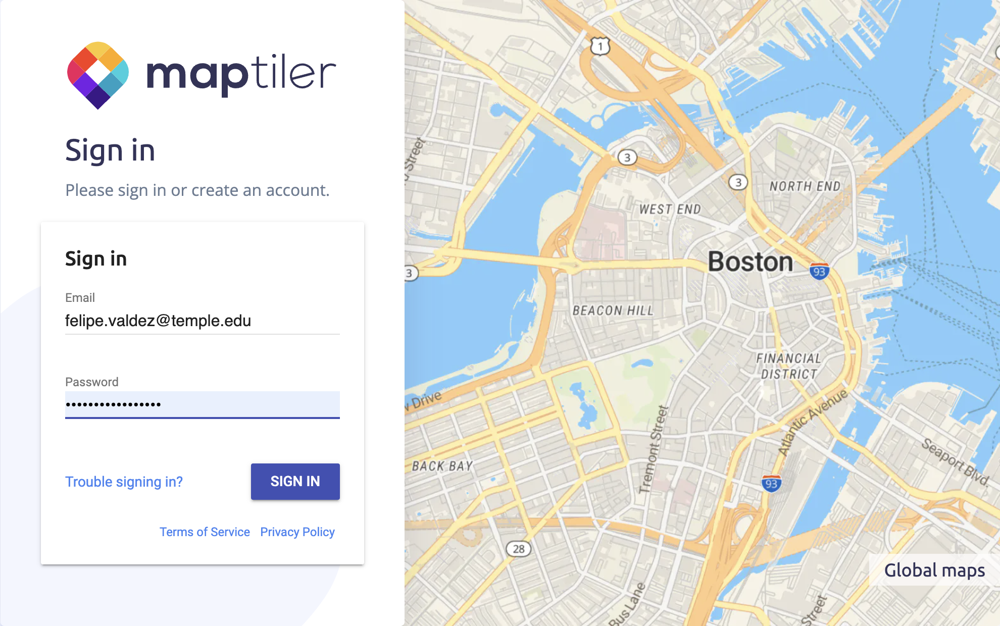
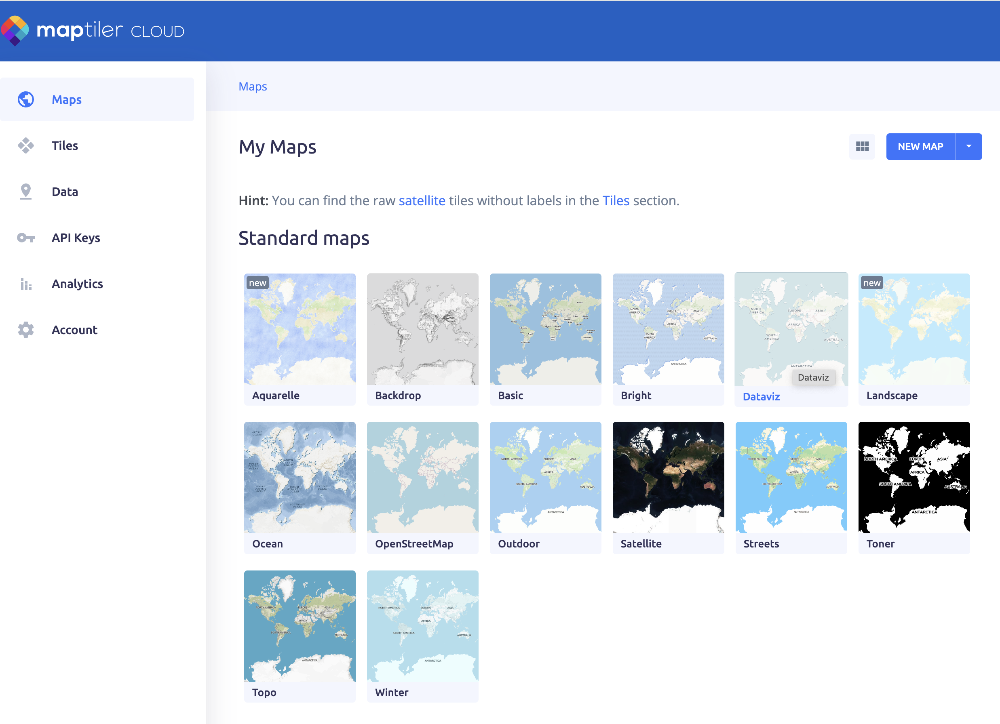
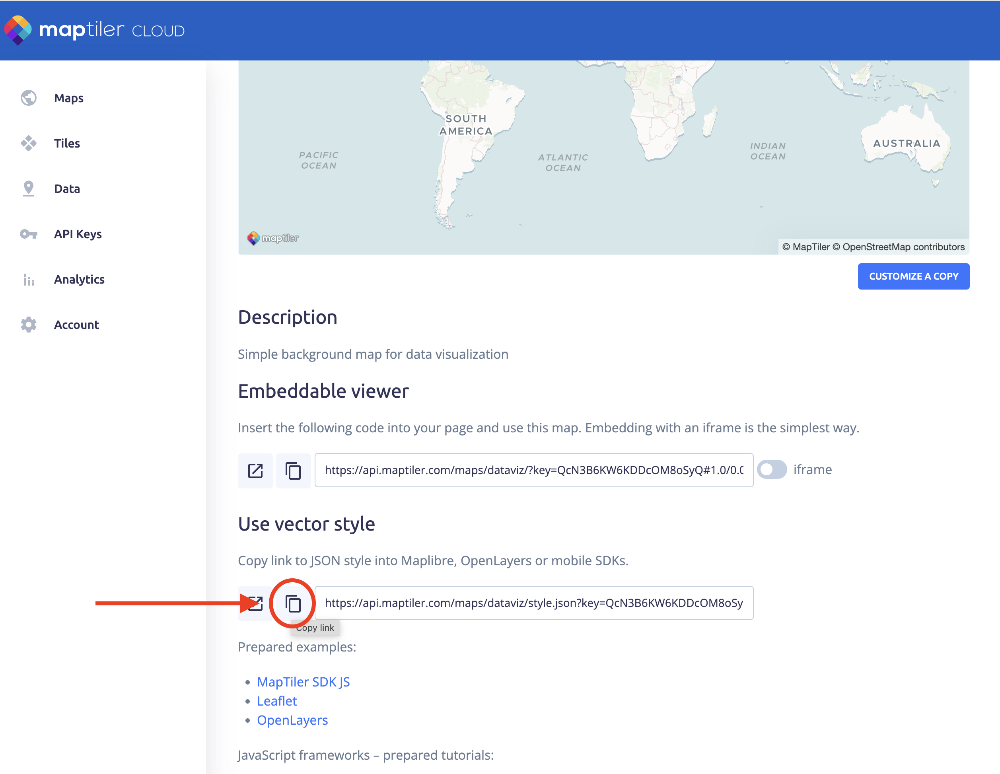

# Add a Map Style

Webmaps are displayed using a set of rules that treat every item on the map in a specific way to render them using the colors, icons and shapes you see in your screen. This rules are stored in a file that can live in your computer or can be accessed via URL.

We will be using the OpenMapStyles from [MapTiler](https://openmaptiles.org/). If you do not have a MapTiler account, check the pre-requistes section to create a free one. 

Follow this steps to add a map style to your story map.

### *1*{: .circle .circle-blue} Sign in to you `MapTiler` account.

On your web browser, go to [this link](https://cloud.maptiler.com/auth/widget?next=https://cloud.maptiler.com/maps/).
Enter you username and password.

  

### *2*{: .circle .circle-blue} Select the map style you want to use.

On the MapTiler Maps screen you will see a list of  pre made open styles.

Click on `DataViz` if you want to follow this tutorial, or any other style you prefer.

 

You can create you own styles using MapTiler OpenMapTyles by clicking on the `New map` button. You can select which layers to display and how.
{: .note }

### *3*{: .circle .circle-blue} Copy the vector style URL

  