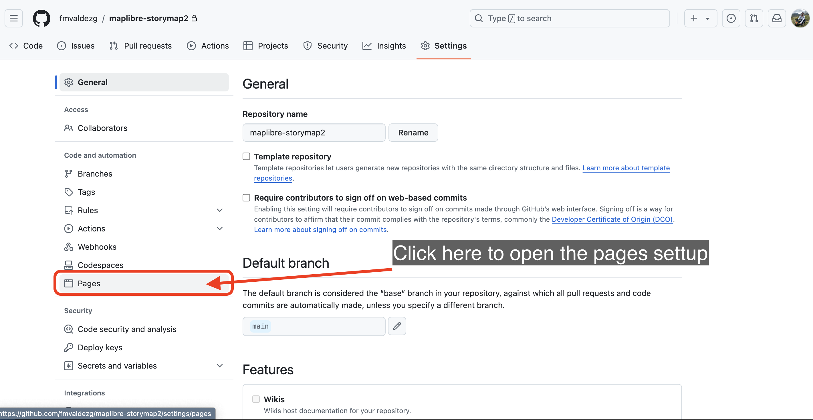
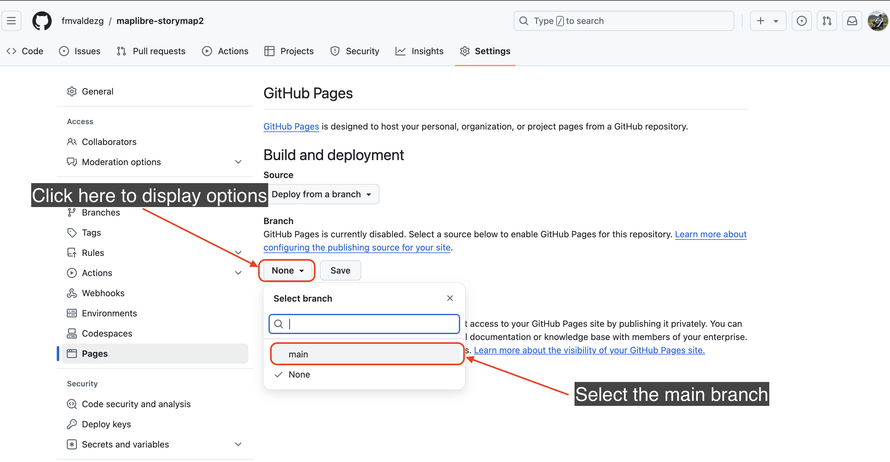
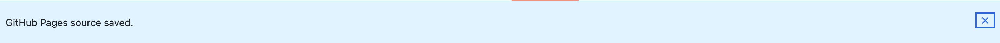
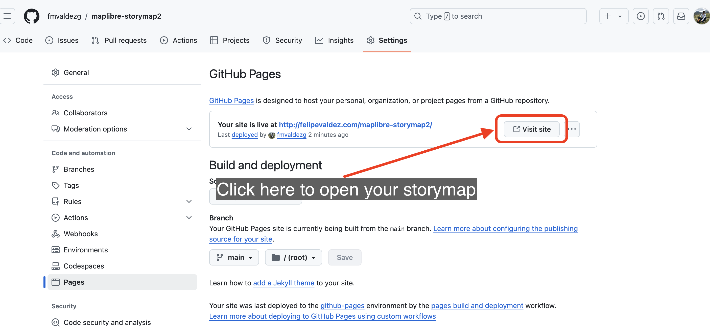

## Deploy your story map as a web page

Now that your story map is finished, it is time to deploy it as a web page. For that we will use `GitHub pages`.

[GitHub Pages](https://docs.github.com/en/pages/getting-started-with-github-pages/about-github-pages) is a static site hosting service that takes HTML, CSS, and JavaScript files straight from a repository on GitHub, optionally runs the files through a build process, and publishes a website.

To publish your map as a web page follow this steps:

Step 1
{: .label .label-step}

Go to `GitHub` cloud and sign in to your account.

You can click on the `View on GitHub` button on your `GitHub Desktop app` to open the repository on your browser.

 

Step 2
{: .label .label-step}

On your repository, click on the `Settings` button on the top menu bar.

Step 3
{: .label .label-step}

If you did not before, you will have to make your repository `public` in order to use GitHub pages.

Simply click on the `General` button on the panel on the left. 

Scroll down to the bottom of the page and click on `Change visibility` and then on `Change to public`.

Confirm that you want to make the repository public.

You might be asked to enter your account password to confirm.
{: .warn }

Step 4
{: .label .label-step}

On the repository Settings, click on the `Pages` button on the left panel options.

Step 5
{: .label .label-step}

On the Pages settings, click on the dropdown menu under the title `Branch` and select the `main` bramch option.

Then click on `Save`. A message like the one below will appear on the screen.

Step 6
{: .label .label-step}

Wait a couple some seconds and the refresh the page.

A new section will appear on the `Pages` settings window with the details of your deployed page.

Click on the `Visit site` button to open the story map on a new browser window.

