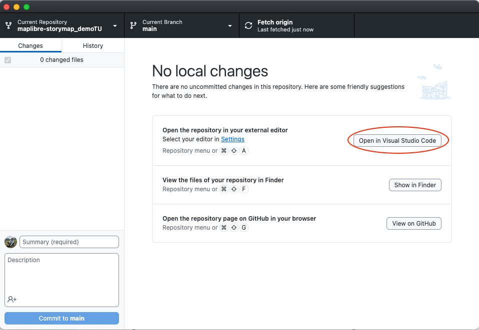
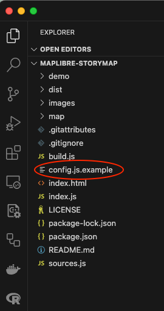
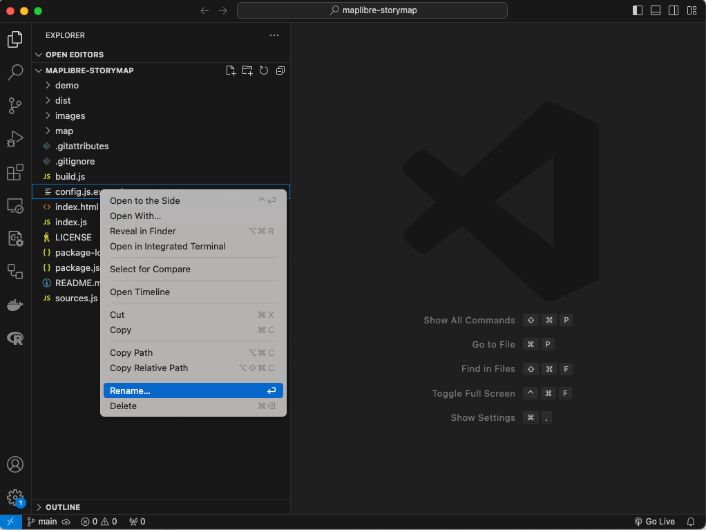
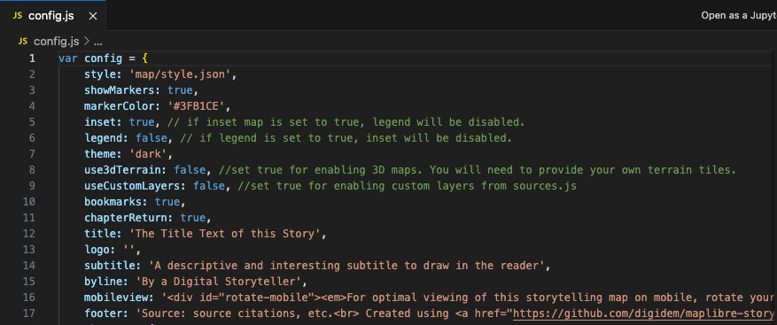

# Edit Your config.js
First we're going to make a few quick edits to your new repository's config.js file. This file contains the story main content and the map controls.

### *1*{: .circle .circle-blue} Open your repository files in `Visual Studio Code`.

While on `GitHub Desktop`, click on the option to `Open in Visual Studio Code`

  

This will open `Visual Studio Code`.

### *2*{: .circle .circle-blue} Rename the file.  

You are going to see a list with all the files and folders on your repository. 

  

Right click on the file `config.js.template` and select the `Rename` option.

  

Change the name of the file to `config.js`, without the word template at the end.

### *3*{: .circle .circle-blue} Make some edits to your `config.js` file.  

Click on the file you just renamed. Its content will be displayed in the central panel on GitHub Desktop.

The first 17 lines of this file contain the main configurations for your new sotrymap. 
We are going to cover some of them to get your story map started. 



Step 1
{: .label .label-step}

Give your map a title by replacing the text after `title:`

Input
{: .label .label-green }
```
12  title: 'My first StoryMap'
```

Be aware that al these properties are build by a pair of values. Values other than boolean (true,flase) should be between ``. 
{: .warn}

Step 2
{: .label .label-step}

Insert a `subtitle` for your story map. Type any text you want to be in the subtitle. Remember that it should be between ``.

Input
{: .label .label-green }
```
14  subtitle: 'This is the most amazing story map ever made!'
```
Step 3
{: .label .label-step}

Put your name as the author of the story map by changing the text of the byline property.

Input
{: .label .label-green }
```
15  byline: 'Felipe Valdez'
```

Step 4
{: .label .label-step}

Add aditional information to your story map in the `footer` property. This is a spot you can use to attribute the data or mention any organizations involved in the making of the map. Also, it is a good practice to keep the MapLibre Storytelling and the link to the project as it is after `<br>`.

Input
{: .label .label-green }
```
17  footer: 'Source: Temple Unievrsity Libraries<br> Created using <a href="https://github.com/digidem/maplibre-storymap" target="_blank">MapLibre Storytelling</a> template.',
```
Most of this properties allow HTML formated text. This means you can add different styles, links and other features. If you want to learn more about HTML follow this [link](https://developer.mozilla.org/en-US/docs/Learn/Getting_started_with_the_web/HTML_basics).
{: .note}