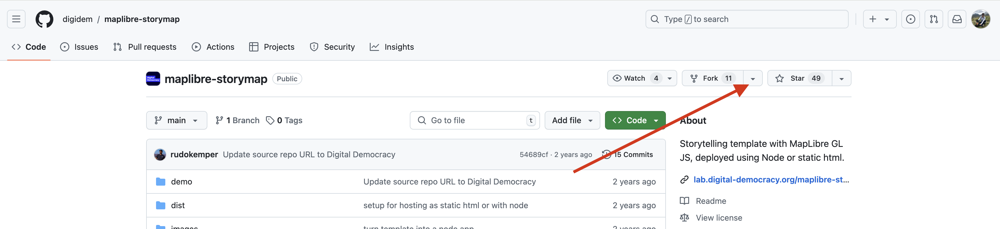
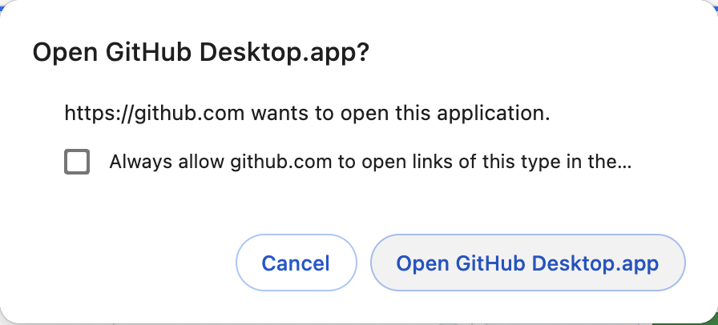
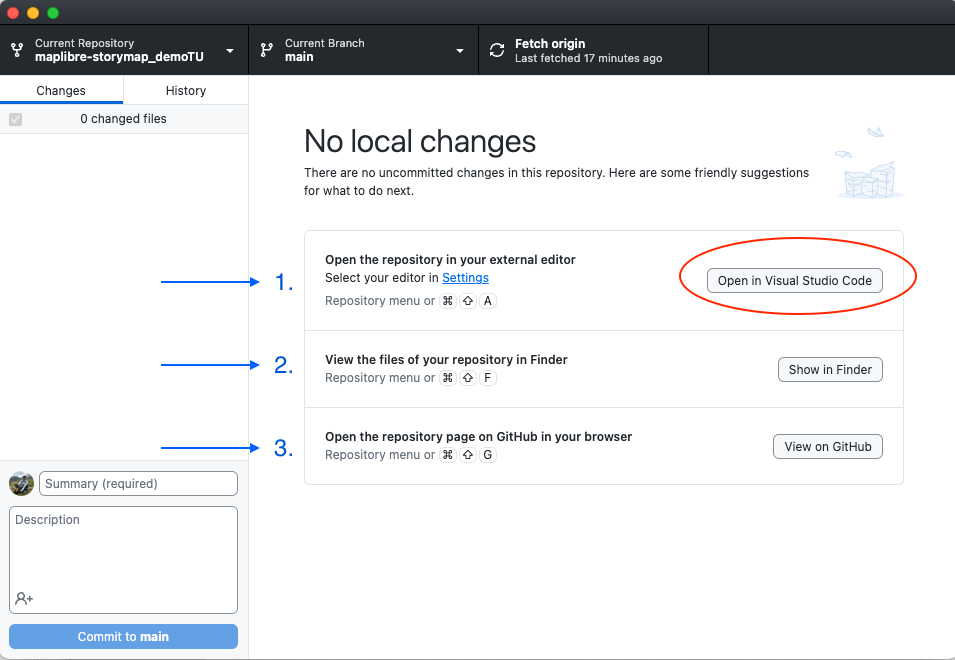

# Fork/Clone the storytelling template
In this workshop we're going to duplicate the storytelling template created by [Digital Democracy](https://www.digital-democracy.org/) to your own GitHub account, then make some edits together. Can tinker and reuse this template anytime on your own account.

### *1*{: .circle .circle-blue} Go to [Digital Democracy Interactive Storytelling with Maplibre repository](https://github.com/digidem/maplibre-storymap){:target="_blank"}

### *2*{: .circle .circle-blue} Click on the option to open the repository in GitHub Desktop
Under the `Code` button, you will see an option to `Open with GitHub Desktop`.   

Confirm that you want to open it by clicking on `Open GitHub Desktop.app` in the message that pops up.

Alternatively, if you are using GitHub on the web, simply fork the repository to your account and continue from there.
{: .note}

`GitHub Desktop` should open in your computer and you should see a window with the infromation of the forked repository, including a panel listing the changes (it will be empty since this is the first time you open it) and three options to start working on your reposity:

If you have `Visual Study Code` installed, you should see the text `Open in Visual Studio Code` in the action button. If you don't have it but you have a different editor (like RStudio, XCode or Atom), then you should see that option. If you need to set `Visual Studio Code` as the default editor for your GitHub Desktop, then follo the instructions [here](https://docs.github.com/en/desktop/configuring-and-customizing-github-desktop/configuring-a-default-editor-in-github-desktop#configuring-a-custom-editor).
{: .warn}

1. Open the repository in your external editor.

2. View the files of your repository in Finder.

3. Open the repository page on GitHub in your browser.

