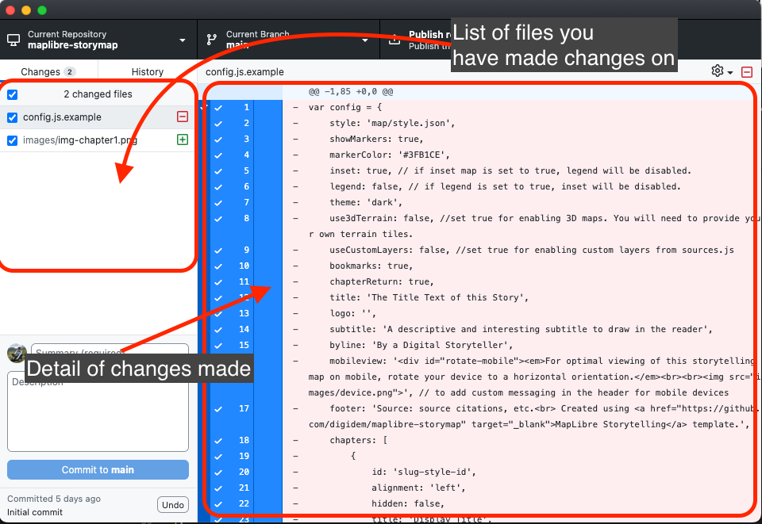
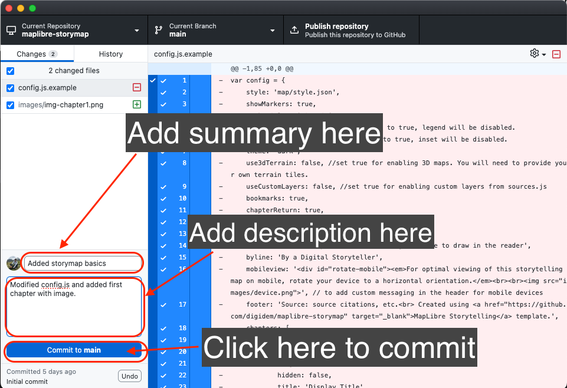
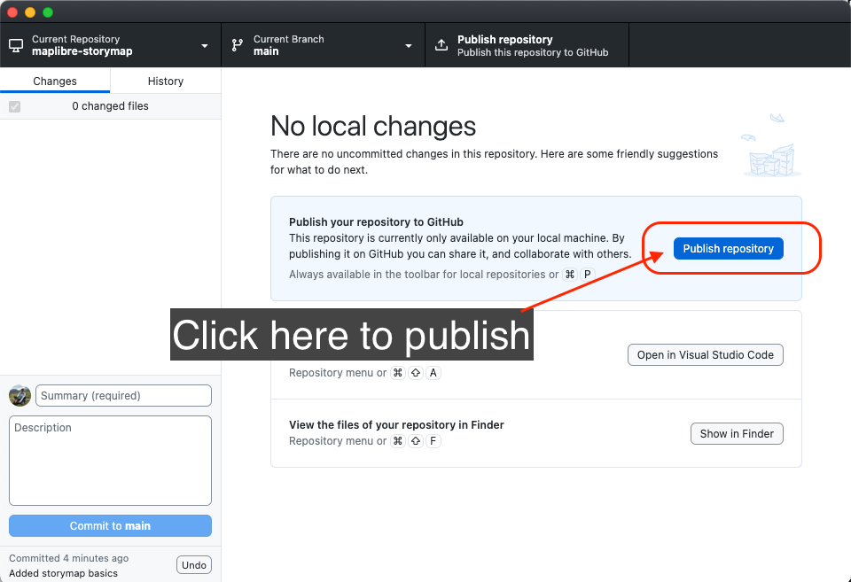
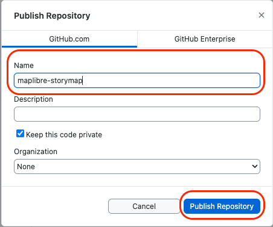

# Preview your storymap

Once you have set and added the basics to your story map, it is a good practice to preview it before deploying it as a webpage. 

To do so, we are going to use the `Visual Studio Code` live server functionality. This will deploy the story map locally in your computer. 

Follow the steps below to preview your story map.

### *1*{: .circle .circle-blue} Commit your changes to `GitHub`.

One of the functions of Git as a version control system is to take snapshots of the changes you make to your files.

A `commit` is a snapshot of your project at that point in time. 

To `commit` your changes:

Step 1
{: .label .label-step}

Go to `GitHub Desktop app`.

You are going to see all the files you have changed listed in the panel at the left side, and all the changes you have made in those files in the panel at the center. If you added something to the file it will be highlited in green and if you deleted something in red.

Review the changes you have made.

Step 2
{: .label .label-step}

On the lower left panel, type a summary for the commit, and optionally a description. It is a good practice to maintain a detailed log of changes made, specially if more than one person is working in the project.

Then click `Commit to main`.

Step 3
{: .label .label-step}

After commiting the changes, `GitHub Dektop` will display the main window of the repository and enable the option to `Publish repository`. A copy of your repository is now abailable in GitHub cloud. 

Go ahead and publish your repository by clicking on `Publish repository`. 

The first time you do this, you will be asked to set a name for your repository and an optional description. Then click `Publish Repository`.

### *1*{: .circle .circle-blue} Preview your storymap locally.

Now that you have published your repository to GitHub cloud, go back to `Visual Studio Code`.

To visualize a preview of your storymap click on the `Go Live` button located in the bar at the lower right corner.

[screenshot of publishing](../img/preview5.png)

A new windows will open in your default internet browser. You will see a preview of your storymap.

Now you can add or modify your `config.js` file and see the changes live on your local computer. To do so, simply save the changes you made in `Visual Studio Code` (press ctrl + s) and refresh the web browser window.

This map is a preview only. It is still living in your system. To publish it as a webpage to be shared and visualized by anyone, follow the instruction in the next section of this tutorial.
{: .note }