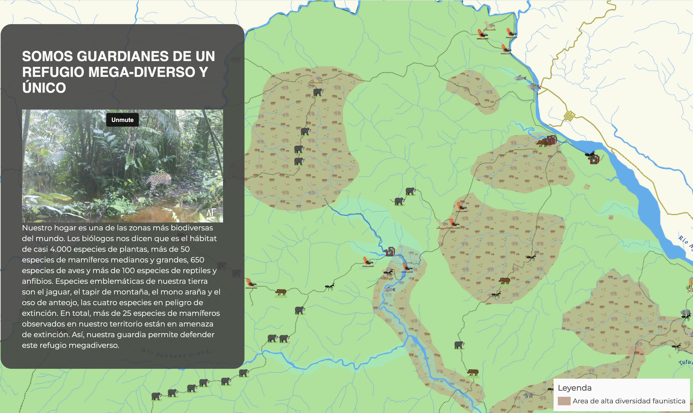

# Why using maps to tell stories

Maps have always been a vital tool for storytelling. They don't just provide context for the narratives we tell; they also serve as visually compelling ways to present information to diverse audiences. Modern technologies have enhanced these maps, adding the power of spatial analysis while offering the ability to generate and share data in real-time and collaboratively. This means that those who view the map can also take part in its creation, transforming them from mere observers into active participants in the story the map tells.

# Check some story maps examples here

[Nuestro Territorio es Nuestra Vida](https://lab.digital-democracy.org/mapa-sinangoe/)

<a src="https://lab.digital-democracy.org/mapa-sinangoe/">

[Ten Conflicts to Watch in 2022](https://conflicts2022.crisisgroup.org/)

<a src="https://conflicts2022.crisisgroup.org/">

[Polar Star Inn and Seipel Hut (Carl's Cabin)](https://map.huttrip.com/)

<a src="https://map.huttrip.com/">
